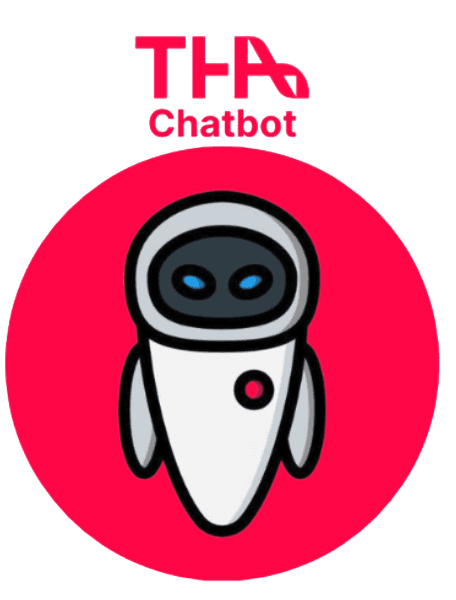
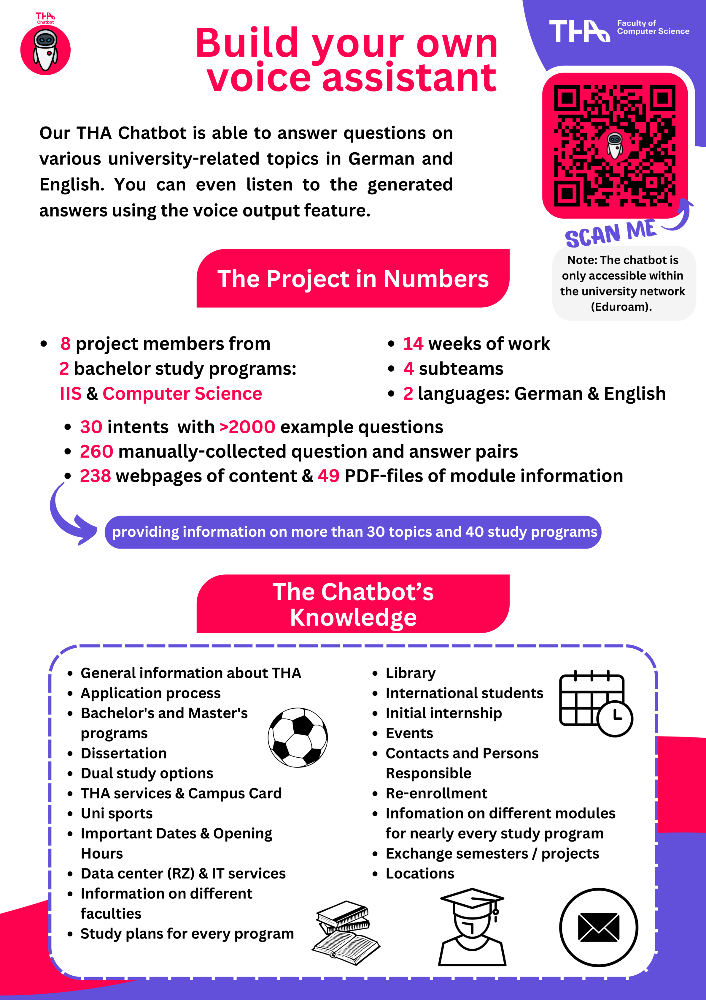
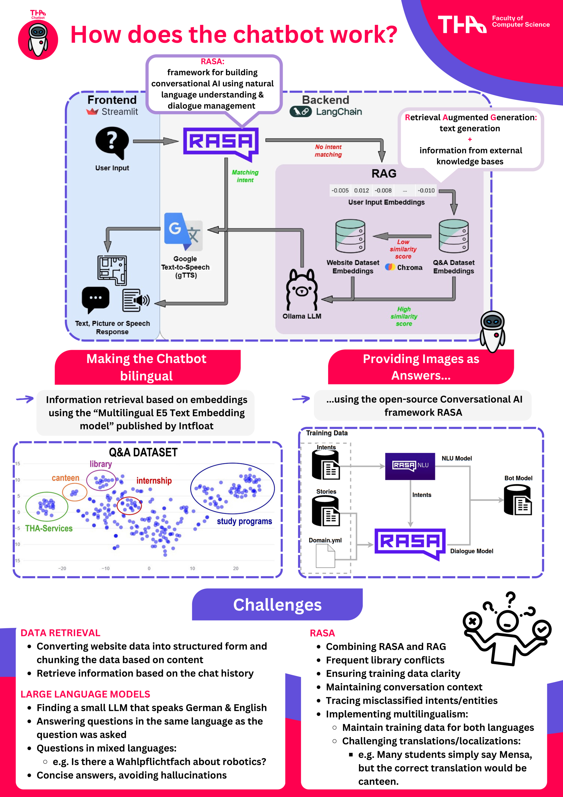

# THA Chatbot




This project's goal was to implement a chatbot that can be used to answer questions about the Technical University Of
Applied Sciences Augsburg. It is based on information about the university that can be found on the official website. We
built the chatbot with the RASA framework, combined with Retrieval Augmented Generation (RAG). RASA is used to answer
simple questions that can be answered with images. If RASA can not answer a question, we use RAG for more complex
questions.
For RAG we use LangChain and a [small 7B LLM](https://ollama.com/marco/em_german_mistral_v01) used with Ollama.

## 🚀 Getting started

First clone the repository and navigate to the project folder.

### 🐳 Installation with Docker (Recommended)

To run the project with Docker, you need to have Docker installed on your machine. If you don't have Docker installed,
you can download it [here](https://www.docker.com/products/docker-desktop). Make sure you have at least 22 GB free space
on your disk.
After you have installed Docker, you can run the following command to build the Docker image and start the container:
```bash
docker compose up
```

This command will build the Docker image and start the container. The first time you run this command, it will take some
time to build the image. After the image is built, the container will start, and you will see the logs of the chatbot in
the terminal.
You can modify the `docker-compose.yml` file to change the configuration of the container. For example, you can change
the port on which the chatbot is running.
The container will run the chatbot on port 8501 by default. You can access the chatbot by navigating
to `http://localhost:8501` in your browser.

<details>
<summary>Optimize performance with GPU access</summary>


Docker containers have initially no access to the GPU. If you want to use the GPU for better performance, you need to
install the NVIDIA drivers and especially the nvidia-container-toolkit.
The installation is described [here](https://docs.docker.com/config/containers/resource_constraints/#gpu).
Verify the successful installation with: `docker run -it --rm --gpus all ubuntu nvidia-smi`.
Lastly, you need to modify the Ollama container inside the `docker-compose.yml` file as follows:

```yaml

ollama:
  build:
    context: ./ollama
    dockerfile: Dockerfile
  container_name: ollama
  hostname: ollama-container
  stdin_open: true
  tty: true
  deploy:
    resources:
      reservations:
        devices:
          - driver: nvidia
            count: all
            capabilities: [ gpu ]
  environment:
    OLLAMA_HOST: 0.0.0.0
  extra_hosts:
    - "host.docker.internal:host-gateway"
  expose:
    - 11434
  volumes:
    - ./ollama:/app
  ports:
    - "11434:11434"
  networks:
    - shared_network
  restart: on-failure

```

For more information, visit the official Docker documentation [here](https://docs.docker.com/compose/gpu-support/).
</details>

### ⚙️ Manual installation (Not recommended)

<details>
<summary>Installation with Conda</summary>

```bash
git clone --single-branch --branch manual_installation https://github.com/alexanderfeix/new_at_the_tha.git
```

After cloning the repository, make sure you have Conda installed on your computer. If you don't have Conda installed,
you can download it [here](https://docs.conda.io/en/latest/miniconda.html).
After you have installed Conda, you need to create two conda environments for RASA and Streamlit:
```bash
conda create -n rasa python=3.10
conda create -n streamlit python=3.10
```

After creating the environments, you need to activate the environments and install the requirements. Make sure you
execute the following commands in the project folder:

```bash
conda activate rasa
pip install -r rasa_requirements.txt
conda activate streamlit
pip install -r chatbot_requirements.txt
```

After installing all the required packages, you need to set up Ollama for loading the Large Language Model.
You can download Ollama [here](https://ollama.com/). Furthermore, you need to install and run the model from the model
file in the project folder:

```bash
ollama create marco/em_german_mistral_v01-coherent -f Modelfile
ollama run marco/em_german_mistral_v01-coherent 
```

Verify the installation with `ollama list`.

#### Running the chatbot

Overall, you need three terminals to run the chatbot. Two terminals are used for RASA and one terminal is used for
Streamlit. You can run the following commands to start the chatbot:

1. Terminal 1: Start the RASA action server in the /backend/rasa/ folder:

```bash
conda activate rasa
rasa run actions
```

2. Terminal 2: Start the RASA server in the /backend/rasa/ folder:

```bash
conda activate rasa
rasa run --enable-api
```

3. Terminal 3: Start the Streamlit server in the project folder:

```bash
conda activate streamlit
streamlit run streamlit_app.py
```

After running these commands, you can access the chatbot by navigating to `http://localhost:8501` in your browser.

</details>

## 📚 Project Overview

  

## 💬 Example questions

English:

- Where can I find the M building?
- What are the opening times of the library?
- How can I reach the university by train?

German:

- Was gibt es heute in der Mensa zu essen?
- Gib mir Informationen zum Kurs "Betriebssysteme" im Informatik Bachelor.
- Wann beginnt der Studiengang Data Science?

## 📝 Copyright

© 2024 Technical University Of Applied Sciences Augsburg

Alexander Feix, Anish Biswas, Aryaman Anand, Joaquín Marí Marcos, Mariia Kutsenko, Osama Alrantisi, Tamara Muras, Yuliia
Novosad

